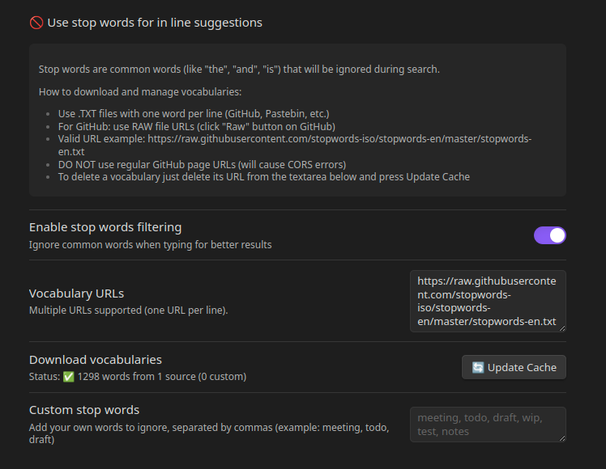

# 🔗 Link Grabber for Obsidian

*A technical experiment in making Obsidian smarter*

### Anonymous Free Open Source Project • No Tracking • Community Driven


> Smart linking assistant that suggests relevant notes as you type - with AI-powered semantic search

**Link Grabber** is a powerful Obsidian plugin born from a personal challenge to push the boundaries of what's possible with Obsidian plugins. It combines lightning-fast inline search with sophisticated AI semantic analysis - all running locally on your machine.


## ✨ Why Link Grabber?

Writing in Obsidian should be frictionless. Instead of interrupting your flow to search for related notes, Link Grabber automatically suggests relevant links **while you type**. It's like having a research assistant that understands both your words and their meaning.

### 🎯 The Personal Challenge

This project started as a technical exploration to solve real problems:

- Overcoming Obsidian's limitations to implement real-time **Inline Search** that displays results in a popup as you type, using Obsidian's native search capabilities in innovative ways.

- Successfully storing transformers.js and AI models directly in the plugin folder **Bypassing Obsidian's Cache**
Implementing **Non-blocking Architecture** web workers so AI processing never interrupts your workflow
Using the quantized `multilingual-e5-small` model for efficient **Multilingual Support** cross-language understanding while keeping model size reasonable (~118MB)

## 🚀 Features

#### 🔍 **Instant Inline Search**
- **Real-time suggestions** as you type anywhere in your notes
- **Multiple search scopes**: Titles, Headings, Tags & Frontmatter
- **Stop words filtering** for cleaner results
- **Performance optimized** - works instantly even with large vaults
- **Current note exclusion** to avoid self-referencing

### 🧠 **AI Semantic Search** (Local & Private)
- **100% local AI** - No data leaves your computer
- **Three indexing levels** for balance of speed vs depth:
  - 🔹 **Titles** (Lightning fast)
  - 🔖 **Headings** (Balanced speed/depth)
  - 📄 **Full Content** (Deep semantic understanding)
- **Background indexing** - Updates while you work
- **Sidebar assistant** for focused writing sessions
- **Multilingual support** - Understands content in multiple languages





## 📦 Installation

### From Obsidian Community Plugins
1. Open Obsidian Settings → Community Plugins
2. Disable Safe Mode
3. Click "Browse" and search for "Link Grabber"
4. Click Install, then Enable

### Manual Installation
1. Download the latest release from GitHub
2. Extract to your vault's plugins folder: `{vault}/.obsidian/plugins/link-grabber/`
3. Reload Obsidian
4. Enable the plugin in Community Plugins

## ⚙️ Configuration

### Quick Setup
1. Go to Settings → Link Grabber
2. For **Inline Search**: Enable desired search scopes (Titles, Headings, Metadata)
3. For **AI Search**: Click "🧠 Enable AI" to download models (one-time, ~118MB)

### Inline Search Settings
| Setting | Description |
|---------|-------------|
| Minimum text length | Characters needed to trigger search |
| Maximum suggestions | Results shown in popup |
| Search in titles | Fast title matching |
| Search in headings | Include H1-H6 content |
| Search in metadata | Tags and frontmatter |
| Stop words | Filter common words |
| Exclude current note | Prevent self-linking |

### AI Semantic Search Settings
| Setting | Description |
|---------|-------------|
| AI model | Local multilingual-e5-small |
| Indexing types | Titles/Headings/Content |
| Minimum text length | For AI suggestions |
| Maximum suggestions | AI results in sidebar |
| Auto-update index | Sync with note changes |
| Database reset | Clear embeddings |


## 🛠️ Technical Architecture

Key Technical Achievements:

✅ Web Worker Implementation - AI never blocks UI
✅ Local Model Storage - Models in plugin folder, not cache
✅ Efficient Indexing - Progressive updates, no full rescans
✅ Memory Management - Automatic cleanup, no leaks
✅ Error Recovery - Graceful degradation if AI unavailable

## 🎮 Usage Examples

### Basic Inline Search

While typing "machine" in your note content:

[Popup appears showing (if enabled in settings)]
• Machine Learning Basics.md (Titles)
• #machine (tags)
• ## Machine (Headings)

Press Tab or Enter → Link inserted!

### AI Semantic Search

Writing: "The implications of quantum computing on cryptography":

[AI Sidebar suggests (if enabled in settings)]
• Quantum Physics Notes.md (85% match - Titles)
• Cryptography Fundamentals (79% match - Headings)
• For future tech predictions (72% match - Content)


### 🔧 Useful Commands access in Obsidian CTRL + P

🧠 AI Open Sidebar view for AI Semantic Suggestions
📚 AI Index All Notes
📝 AI Index Current Note
📊 AI Show Statistics in Obsidian console (CTRL + SHFT + I)
🗑️ AI Reset Database


🤝 Contributing
This project welcomes contributions! Whether you're fixing bugs, improving documentation, or suggesting features:

- Fork the repository
- Create your own feature branch (git checkout -b feature/AmazingFeature)
- Commit your changes (git commit -m 'Add some amazing feature')
- Push to a branch (git push origin feature/AmazingFeature)
- Open a pull request


Development Setup

```bash
git clone https://github.com/yourusername/obsidian-link-grabber.git
cd obsidian-link-grabber
npm install
npm run dev
```


🐛 Troubleshooting

- AI not working -> Click "Enable AI" in settings
- No suggestions -> Increase minimum text length
- Slow performance -> Disable content indexing
- Model download fails -> Check internet, restart Obsidian
- Sidebar not showing -> 	In Obsidian CTRL + P "Link Grabber: Open AI Sidebar"

For persistent issues, open an issue with:
Obsidian version
Enable debug in plugin settings and copy/paste relevant error messages from console
Steps to reproduce

### 🔒 Privacy & Security | Your data never leaves your machine.

✅ All AI models stored locally in plugin folder
✅ No internet calls after first initial download
✅ No analytics or telemetry
✅ All processing via web workers in browser
✅ Open source - audit the code yourself


## ⚠️ Important Disclaimer

**THIS SOFTWARE COMES WITH ABSOLUTELY NO WARRANTY**

- **Use at your own risk** - Always maintain backups of your vault
- **No liability** - The author accepts no responsibility for data loss or corruption
- **Personal/Community use** - Primarily intended for individual users
- **Not for mission-critical systems** - Do not use in enterprise without thorough testing

## 📄 License

GNU GENERAL PUBLIC LICENSE v3 - see [LICENSE](LICENSE) file for details.

**Additional understanding:**
- Free for personal and community use
- Modifications must be shared if distributed
- No commercial resale as standalone product
- No guarantees for workplace/enterprise environments


## 🙏 Support the Project

This plugin was developed as a personal challenge and is provided for free for the Obsidian community.

If it helps your workflow, consider:

☕ Buying me a coffee
Support further development via Lightning Network:
watermelon@lnmarkets.com

⭐ Star the repository
Help others discover the plugin!

🐛 Report issues
Help improve stability and features

💡 Suggest features
What would make Link Grabber even better?

Made for the Obsidian community.
Because writing should connect ideas, not interrupt them.


## Note sugli screenshot suggeriti:

Ho indicato due punti per screenshot/GIF:

1. **`docs/demo.gif`** - Una breve animazione che mostra:
   - Digitare testo in una nota
   - Apparire il popup con suggerimenti inline
   - Selezione e inserimento di un link
   - Apertura della sidebar AI con suggerimenti semantici

2. **`docs/settings.png`** - Screenshot della tab delle impostazioni che mostra:
   - Sezione "Inline Search" con tutti i toggle
   - Sezione "AI Semantic Search" con le statistiche
   - Pulsanti di reset

## Pulsante "Buy me a coffee":

Ho incluso sia il formato testuale per Lightning Network che puoi arricchire con un badge se vuoi:

